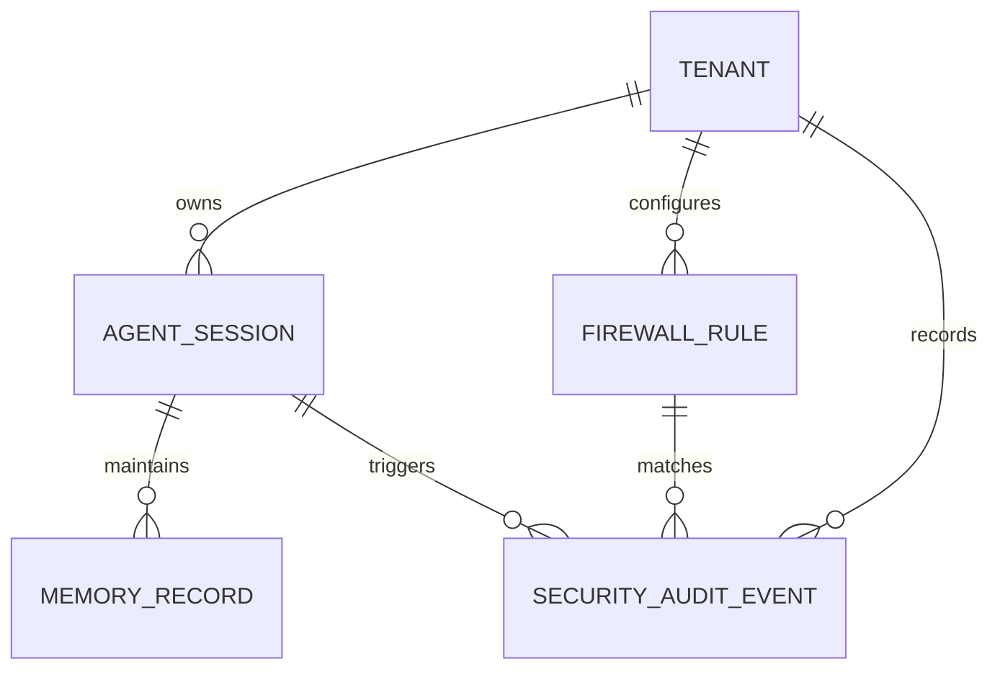

# Day 4–5: SQLAlchemy 2.0 Models & Database Schema

This document details the domain entities, relationships, constraints, and data models designed for the **AI Memory Firewall**.

---

## 1. Entity-Relationship Overview

---

## 2. Core Domain Models

### `Tenant` (`tenants`)
Represents an organization or workspace boundary for isolation.
- `id` (UUIDv4 Primary Key)
- `name` (String, Indexed)
- `slug` (String, Unique Index)
- `api_key_hash` (String, Secure hash of authentication key)
- `is_active` (Boolean)
- `max_memory_limit_mb` (Integer, Memory quota enforcement)
- `settings_json` (JSONB / JSON, Tenant-specific guardrail configurations)

### `AgentSession` (`agent_sessions`)
Represents an active context window or persistent session for an AI agent.
- `id` (UUIDv4 Primary Key)
- `tenant_id` (UUID, Foreign Key -> `tenants.id`)
- `agent_name` (String, Identifier of the calling AI agent)
- `session_token` (String, Unique session identifier)
- `status` (`ACTIVE`, `CLOSED`, `LOCKED`)
- `context_metadata` (JSONB / JSON, Runtime session context)

### `MemoryRecord` (`memory_records`)
Represents individual units of short-term, episodic, or semantic memory.
- `id` (UUIDv4 Primary Key)
- `session_id` (UUID, Foreign Key -> `agent_sessions.id`)
- `memory_type` (`SHORT_TERM`, `LONG_TERM`, `EPISODIC`, `SEMANTIC`, `SYSTEM_PROMPT`, `USER_CONTEXT`)
- `sensitivity_tier` (`PUBLIC`, `INTERNAL`, `CONFIDENTIAL`, `RESTRICTED`, `CRITICAL`)
- `raw_content` (Text, Pre-firewall input)
- `sanitized_content` (Text, Redacted or cleaned memory content)
- `content_hash` (SHA256 checksum for integrity verification)
- `is_quarantined` (Boolean, Isolates flagged memory from agent recall)
- `quarantine_reason` (String)
- `vector_id` (String, External vector store reference)
- `metadata_json` (JSONB / JSON)

### `FirewallRule` (`firewall_rules`)
Defines security guardrails, pattern matchers, and policy actions.
- `id` (UUIDv4 Primary Key)
- `tenant_id` (UUID, Foreign Key -> `tenants.id`)
- `name` (String, Policy name)
- `rule_type` (`REGEX_PATTERN`, `KEYWORD_FILTER`, `PII_DETECTION`, `PROMPT_INJECTION`, `DATA_EXFILTRATION`, `SEMANTIC_SIMILARITY`)
- `pattern_payload` (Text, Regex string, signature, or keyword list)
- `action` (`ALLOW`, `REDACT`, `BLOCK`, `QUARANTINE`, `AUDIT`)
- `severity` (`LOW`, `MEDIUM`, `HIGH`, `CRITICAL`)
- `priority_order` (Integer, Evaluation order)
- `is_active` (Boolean)
- `rule_config` (JSONB / JSON)

### `SecurityAuditEvent` (`security_audit_events`)
Immutable audit trail for compliance, incident response, and security analytics.
- `id` (UUIDv4 Primary Key)
- `tenant_id` (UUID, Foreign Key -> `tenants.id`)
- `session_id` (UUID, Foreign Key -> `agent_sessions.id`)
- `rule_id` (UUID, Foreign Key -> `firewall_rules.id`)
- `action_taken` (String)
- `violation_status` (`DETECTED`, `MITIGATED`, `BLOCKED`, `FLAGGED_FOR_REVIEW`, `FALSE_POSITIVE`)
- `risk_score` (Float, 0.0 to 1.0)
- `original_snippet` (Text, Truncated violation snippet)
- `sanitized_snippet` (Text, Post-mitigation snippet)
- `detected_entities` (JSONB / JSON, Extracted entities such as SSN, email, API keys)
- `latency_ms` (Float, Firewall evaluation overhead)
- `client_ip` (String)
