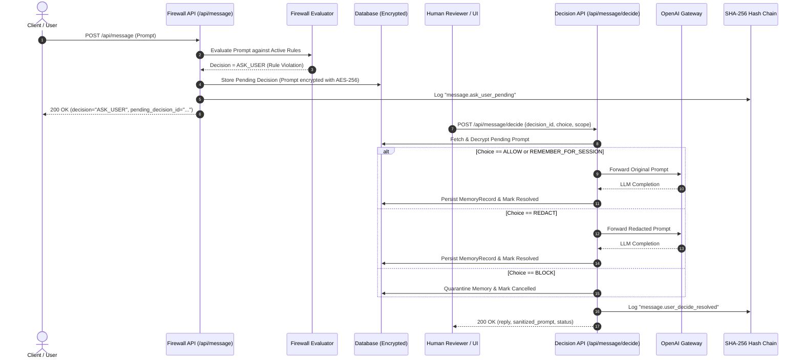

# AI Memory Firewall - Week 8: ASK_USER Flow & User Decisions

> **Milestone**: Week 8 — Human-in-the-Loop (HITL) Safety Confirmation & User Decision Persistence  
> **Status**: Complete & Validated (323/323 Tests Passing)  
> **Author**: Antigravity Core Engineering Team  

---

## 1. Executive Summary

In enterprise AI agent deployments, pure binary actions (*ALLOW* vs *BLOCK*) are frequently inadequate when handling sensitive or borderline user prompts (e.g., financial transaction confirmations, PII sharing across organizational boundaries, high-risk code executions). 

**Week 8** introduces a **Human-in-the-Loop (HITL) Confirmation System** to the AI Memory Firewall:
1. **Interactive Pause & Resume Pipeline**: When an inbound prompt triggers a policy or custom firewall rule designated with `RuleAction.ASK_USER`, execution is safely suspended before invoking external LLMs.
2. **REST Decision Gate**: Human reviewers or client applications submit choices via `POST /api/message/decide` (`ALLOW`, `REDACT`, `BLOCK`, `REMEMBER_FOR_SESSION`).
3. **AES-256 Fernet Prompt Encryption at Rest**: The raw user prompt is encrypted at rest in the `user_decisions` table using symmetric Fernet keys, preventing unauthorized database inspection while awaiting resolution.
4. **Session Preference Inheritance**: Selecting `REMEMBER_FOR_SESSION` automatically records a session-scoped policy override so subsequent turns in the same session proceed without repetitive prompts.
5. **Fail-Safe Timeout Fallback**: Expired decisions automatically default to `REDACT` (Option A), preventing security deadlocks and data leakage.
6. **OpenAI Retry Resilience**: Outbound LLM communications are protected with exponential backoff retries for transient errors (HTTP 429, 500, 502, 503, 504).
7. **Tamper-Proof Audit Logging**: Every human decision event is cryptographically sealed into the SHA-256 ledger hash chain.

---

## 2. Architecture & State Machine

### 2.1 ASK_USER Lifecycle Flow



---

## 3. Data Models & Database Schema

### 3.1 `user_decisions` Table

The `user_decisions` model tracks human approval states, prompt context, and scopes:

```python
class DecisionStatus(str, Enum):
    PENDING   = "PENDING"
    RESOLVED  = "RESOLVED"
    EXPIRED   = "EXPIRED"
    CANCELLED = "CANCELLED"

class DecisionChoice(str, Enum):
    ALLOW                = "ALLOW"
    REDACT               = "REDACT"
    BLOCK                = "BLOCK"
    REMEMBER_FOR_SESSION = "REMEMBER_FOR_SESSION"

class DecisionScope(str, Enum):
    ONCE    = "ONCE"
    SESSION = "SESSION"
    TENANT  = "TENANT"
```

```sql
CREATE TABLE user_decisions (
    id UUID PRIMARY KEY DEFAULT gen_random_uuid(),
    session_id UUID NOT NULL REFERENCES agent_sessions(id) ON DELETE CASCADE,
    tenant_id UUID NOT NULL REFERENCES tenants(id) ON DELETE CASCADE,
    message_id UUID NOT NULL,
    status VARCHAR(32) NOT NULL DEFAULT 'PENDING',
    choice VARCHAR(32) NULL,
    scope VARCHAR(32) NOT NULL DEFAULT 'ONCE',
    trigger_reason VARCHAR(512) NOT NULL,
    entity_type VARCHAR(128) NULL,
    matched_text VARCHAR(512) NULL,
    original_prompt TEXT NOT NULL,       -- Encrypted with AES-256 Fernet
    sanitized_prompt TEXT NOT NULL,
    model VARCHAR(64) NOT NULL DEFAULT 'gpt-4o-mini',
    system_prompt TEXT NULL,
    temperature FLOAT NOT NULL DEFAULT 0.7,
    max_tokens INTEGER NULL,
    metadata_json JSONB NULL,
    created_at TIMESTAMP WITH TIME ZONE DEFAULT NOW(),
    updated_at TIMESTAMP WITH TIME ZONE DEFAULT NOW(),
    resolved_at TIMESTAMP WITH TIME ZONE NULL,
    expires_at TIMESTAMP WITH TIME ZONE NULL
);

CREATE INDEX idx_user_decisions_session_status ON user_decisions(session_id, status);
CREATE INDEX idx_user_decisions_tenant_id ON user_decisions(tenant_id);
```

---

## 4. API Endpoints

### 4.1 `POST /api/message` (ASK_USER Response)

When a rule with `action="ASK_USER"` triggers, the endpoint immediately returns HTTP 200 with `pending_decision_id` and guidance:

```json
{
  "message_id": "7fa84bf3-f02a-46da-b09e-3d02d08a5c36",
  "session_id": "b0331cd9-e5e8-4d88-badf-5e23eb49934f",
  "tenant_id": "e8869819-cc43-4aae-8789-5f7c1228be4a",
  "decision": "ASK_USER",
  "inbound_risk_score": 0.50,
  "outbound_risk_score": null,
  "reply": null,
  "sanitized_prompt": "Please initiate a [REDACTED] of $5,000 to routing number 123456789.",
  "violations": [
    {
      "rule_name": "Confirm Wire Transfer Data",
      "rule_type": "KEYWORD_FILTER",
      "action": "ASK_USER",
      "severity": "MEDIUM",
      "matched_text": "wire transfer",
      "risk_contribution": 0.50
    }
  ],
  "memory_stored": false,
  "memory_encrypted": false,
  "audit_logged": true,
  "latency_ms": {
    "inbound_eval_ms": 3.12,
    "memory_store_ms": 0.0,
    "llm_ms": 0.0,
    "outbound_eval_ms": 0.0,
    "audit_log_ms": 1.45,
    "total_ms": 4.57
  },
  "is_mock": false,
  "pending_decision_id": "d742691e-b816-43b9-a226-e17f54c9ea77",
  "ask_user_details": {
    "trigger_reason": "Triggered by rule: Confirm Wire Transfer Data",
    "entity_type": "KEYWORD_FILTER",
    "matched_text": "wire transfer",
    "available_choices": [
      "ALLOW",
      "REDACT",
      "BLOCK",
      "REMEMBER_FOR_SESSION"
    ]
  }
}
```

### 4.2 `POST /api/message/decide`

Submits human resolution for a pending confirmation:

#### Request Body
```json
{
  "decision_id": "d742691e-b816-43b9-a226-e17f54c9ea77",
  "decision": "ALLOW",
  "scope": "ONCE"
}
```

#### Response Body (ALLOW)
```json
{
  "decision_id": "d742691e-b816-43b9-a226-e17f54c9ea77",
  "session_id": "b0331cd9-e5e8-4d88-badf-5e23eb49934f",
  "tenant_id": "e8869819-cc43-4aae-8789-5f7c1228be4a",
  "status": "RESOLVED",
  "applied_decision": "ALLOW",
  "reply": "Your wire transfer request has been initiated successfully.",
  "sanitized_prompt": "Please initiate a wire transfer of $5,000 to routing number 123456789.",
  "memory_stored": true,
  "audit_logged": true,
  "latency_ms": {
    "inbound_eval_ms": 0.0,
    "memory_store_ms": 1.20,
    "llm_ms": 312.45,
    "outbound_eval_ms": 2.10,
    "audit_log_ms": 1.15,
    "total_ms": 316.90
  }
}
```

### 4.3 `GET /api/message/pending/{session_id}`

Lists all active decisions waiting for human review in a specific conversation session.

---

## 5. Security & Reliability Highlights

### 5.1 Symmetric Fernet Encryption at Rest
All pending prompts in `user_decisions.original_prompt` are stored strictly as Fernet ciphertext tokens using `src.security.encrypt_data()`. Cleartext is never persisted to disk or exposed via the pending list endpoint.

### 5.2 OpenAI Exponential Backoff Retry
The OpenAI integration client in `src/services/openai_service.py` is equipped with automatic retry handling:
- **Eligible Statuses**: 429 (Rate Limit), 500 (Internal Server Error), 502 (Bad Gateway), 503 (Service Unavailable), 504 (Gateway Timeout).
- **Backoff Formula**: $T_{wait} = \min(\text{initial\_backoff} \times 2^{\text{attempt}}, \text{max\_backoff})$.
- **Fallback**: Automatically falls back to mock responses or raises clean `HTTPException(503)` if configured retries (default 3) are exhausted.

### 5.3 Audit Trail Verification
Every decision transition creates a cryptographically verifiable ledger entry in `audit_ledger_entries`:
- `action`: `message.ask_user_pending` (upon suspension)
- `action`: `message.user_decide_resolved` (upon resolution)
- `action`: `message.user_decide_blocked` (upon BLOCK)

---

## 6. Verification & Test Matrix

The Week 8 test suite in `tests/test_ask_user_flow.py` comprehensively validates all 13 core scenarios:

| # | Test Case | Purpose & Assertion | Status |
|---|---|---|---|
| 1 | `test_ask_user_rule_triggers_confirmation` | Validates that a rule with `action=ASK_USER` pauses pipeline and generates pending decision | ✅ PASS |
| 2 | `test_decide_allow_flow` | Validates `ALLOW` resolution, unredacted prompt forwarding, and memory persistence | ✅ PASS |
| 3 | `test_decide_redact_flow` | Validates `REDACT` resolution with redacted prompt forwarded to LLM | ✅ PASS |
| 4 | `test_decide_block_flow` | Validates `BLOCK` resolution, memory quarantine, and execution cancellation | ✅ PASS |
| 5 | `test_decide_remember_for_session_flow` | Validates session preference persistence so turn 2 bypasses confirmation | ✅ PASS |
| 6 | `test_decide_nonexistent_decision_404` | Validates 404 response for invalid or non-existent decision IDs | ✅ PASS |
| 7 | `test_decide_already_resolved_409` | Validates 409 Conflict when re-submitting an already resolved decision | ✅ PASS |
| 8 | `test_list_pending_decisions_for_session` | Validates retrieval of pending decisions via `GET /api/message/pending/{session_id}` | ✅ PASS |
| 9 | `test_user_decision_encryption_at_rest` | Validates AES-256 Fernet ciphertext in raw database column | ✅ PASS |
| 10 | `test_timeout_fallback_to_redact` | Validates safe fallback defaulting to `REDACT` on expired decisions | ✅ PASS |
| 11 | `test_hash_chain_audit_logging_on_decision` | Validates cryptographic hash-chain sealing of decision events | ✅ PASS |
| 12 | `test_dual_endpoint_decide_mounting` | Validates parity across `/api/message/decide` and `/api/v1/message/decide` | ✅ PASS |
| 13 | `test_openai_retry_resilience` | Validates exponential backoff retry on HTTP 429/500 errors | ✅ PASS |

**Total Repository Suite**: 323 / 323 Passed (100% pass rate).
